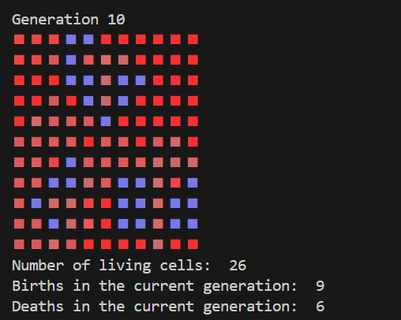

# Conway's Game of Life

## Description:

This project is a Python implementation of Conway's Game of Life, a cellular automation where cells are either alive or dead. @ represents a living cell and * represents a dead cell. Each generation is calculated using Conway's rules based on the number of living neighbours.

The simulation runs in the terminal and provides a visual representation of how the grid changes over time. Living cells are displayed in blue, while dead cells are shown using different shades of red depending on how long they have remained dead. Recently dead cells use lighter shades, gradually changing towards bright red for cells that have been dead for longer. This colour gradient makes the history and activity of different areas of the grid easier to observe like shown in the image.

The program also displays the number of living cells, births, and deaths for each generation. Random starting configurations can be generated for each run using a configurable density.

### Install and synchronize dependencies:
uv sync

### Run the simulation:
python life.py glider.txt

### Specify the number of generations(optional):
python life.py glider.txt 20

### Run tests:
uv run pytest

## Project Structure:

life.py – Typer command-line interface
functions.py – create grid, count neighbors, next generation and display grid
simulation.py – grid parsing, random grid generation, statistics and simulation
test_.py - pytest for the finctions

## AI-Assisted Programming Reflection:

I used ChatGPT to understand Python concepts, debug errors, and explore possible implementations. My prompts covered neighbour counting, grid generation for txt file, ANSI colours, Simulation terminated by user when any key is pressed and Typer.

Suggestions for generating random grids and expected output for the first generation, using ANSI colour codes were particularly useful. However, some generated code needed modification. For example, the initial Typer implementation did not correctly handle the generating optional argument, and some colour suggestions did not match the gradient I wanted.

I learned that AI is useful for explaining concepts and suggesting solutions, but its output must be tested and adapted. 
